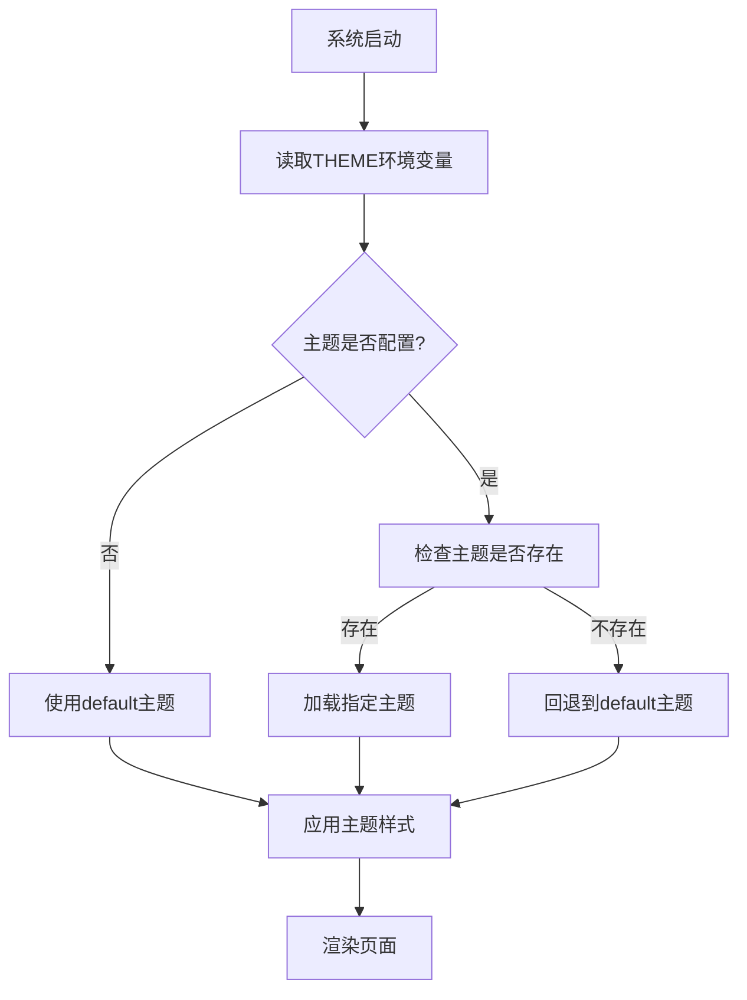

# BroadcastChannel 多主题支持系统 - 产品需求文档

## 1. 产品概述

为BroadcastChannel项目开发一个灵活的多主题支持系统，允许用户通过环境变量动态切换不同的视觉主题风格。

该系统将基于现有的CSS变量架构，提供主题的热切换能力，并包含默认主题和iOS风格主题，同时为开发者提供完善的主题开发规范和文档。

## 2. 核心功能

### 2.1 用户角色

| 角色 | 使用方式 | 核心权限 |
|------|----------|----------|
| 最终用户 | 通过环境变量配置 | 可切换和使用不同主题 |
| 主题开发者 | 按照开发规范创建主题 | 可开发和发布新主题 |
| 系统管理员 | 部署和配置系统 | 可管理主题配置和环境变量 |

### 2.2 功能模块

我们的多主题支持系统包含以下主要模块：

1. **主题管理模块**：主题注册、加载、切换逻辑
2. **配置管理模块**：环境变量解析、主题配置读取
3. **资源管理模块**：CSS文件、图标、字体等资源的动态加载
4. **回退机制模块**：主题不存在时的默认主题回退逻辑

### 2.3 页面详情

| 页面名称 | 模块名称 | 功能描述 |
|----------|----------|----------|
| 主题配置页面 | 主题选择器 | 显示可用主题列表，支持预览和切换 |
| 开发者文档页面 | 文档展示 | 展示主题开发规范、API文档和示例代码 |
| 主题预览页面 | 实时预览 | 提供主题效果的实时预览功能 |

## 3. 核心流程

### 主要用户操作流程

1. **主题切换流程**：用户配置环境变量 → 系统检测主题配置 → 加载对应主题资源 → 应用主题样式
2. **主题开发流程**：开发者创建主题目录 → 编写主题配置文件 → 开发样式资源 → 注册主题 → 测试验证
3. **系统启动流程**：读取环境变量 → 解析主题配置 → 验证主题存在性 → 加载主题或回退到默认主题

## 4. 用户界面设计

### 4.1 设计风格

- **主色调**：支持主题自定义，默认主题保持现有的橙红色(#ff4500)
- **按钮样式**：圆角设计，支持主题变量控制
- **字体**：系统字体栈，支持主题自定义字体
- **布局风格**：卡片式布局，响应式设计
- **图标风格**：SVG图标，支持主题色彩适配

### 4.2 页面设计概览

| 页面名称 | 模块名称 | UI元素 |
|----------|----------|--------|
| 主题配置页面 | 主题选择器 | 主题卡片、预览缩略图、切换按钮、主题名称和描述 |
| 开发者文档页面 | 文档展示 | 代码高亮、示例预览、目录导航、搜索功能 |
| 主题预览页面 | 实时预览 | 分屏预览、主题对比、样式检查器 |

### 4.3 响应式设计

系统采用移动优先的响应式设计，支持桌面端和移动端的主题切换体验，确保在不同设备上都能正常使用主题功能。