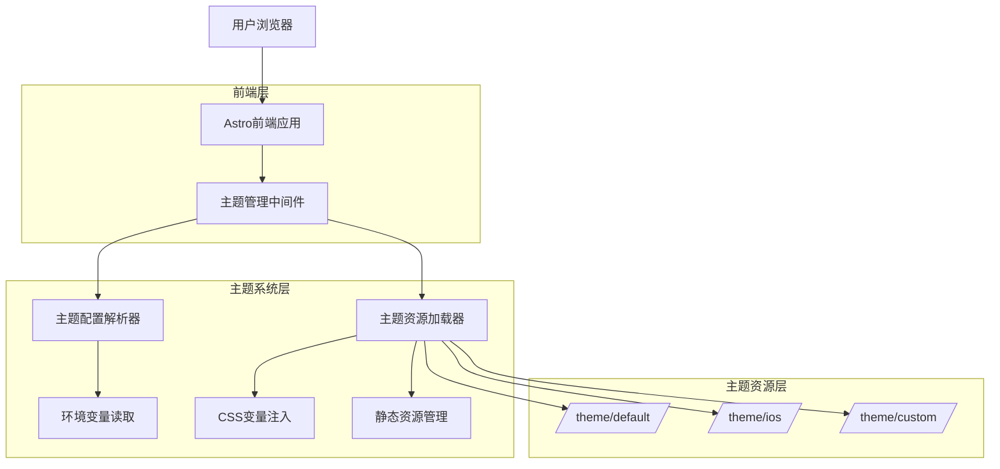
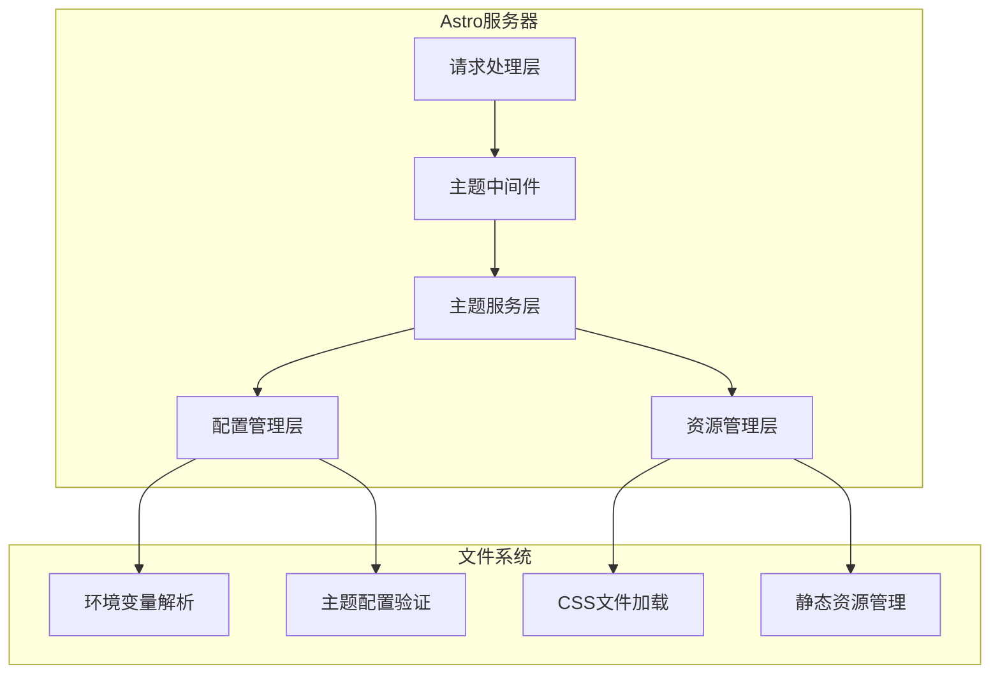

# BroadcastChannel 多主题支持系统 - 技术架构文档

## 1. 架构设计



## 2. 技术描述

- 前端：Astro@4 + CSS变量系统 + TypeScript
- 主题系统：基于CSS变量的动态主题切换
- 配置管理：环境变量 + JSON配置文件
- 资源管理：静态文件 + 动态导入

## 3. 路由定义

| 路由 | 用途 |
|------|------|
| / | 主页面，应用当前主题样式 |
| /theme-preview | 主题预览页面，支持主题切换预览 |
| /docs/themes | 主题开发文档页面 |

## 4. API定义

### 4.1 主题管理API

主题配置获取
```typescript
GET /api/theme/config
```

响应：
| 参数名称 | 参数类型 | 描述 |
|----------|----------|------|
| currentTheme | string | 当前激活的主题名称 |
| availableThemes | string[] | 可用主题列表 |
| themeConfig | ThemeConfig | 当前主题的配置信息 |

示例响应：
```json
{
  "currentTheme": "default",
  "availableThemes": ["default", "ios"],
  "themeConfig": {
    "name": "default",
    "displayName": "默认主题",
    "version": "1.0.0",
    "variables": {
      "--background-color": "#f4f1ec",
      "--foreground-color": "#000000"
    }
  }
}
```

### 4.2 类型定义

```typescript
// 主题配置接口
interface ThemeConfig {
  name: string
  displayName: string
  description?: string
  version: string
  author?: string
  variables: Record<string, string>
  assets?: {
    icons?: string[]
    fonts?: string[]
    images?: string[]
  }
}

// 主题管理器接口
interface ThemeManager {
  getCurrentTheme(): string
  getAvailableThemes(): string[]
  loadTheme(themeName: string): Promise<ThemeConfig>
  applyTheme(themeConfig: ThemeConfig): void
  validateTheme(themeName: string): boolean
}
```

## 5. 服务器架构图



## 6. 数据模型

### 6.1 主题目录结构

```
theme/
├── default/                 # 默认主题
│   ├── theme.json          # 主题配置文件
│   ├── variables.css       # CSS变量定义
│   ├── components.css      # 组件样式
│   └── assets/            # 主题资源
│       ├── icons/
│       ├── fonts/
│       └── images/
├── ios/                    # iOS风格主题
│   ├── theme.json
│   ├── variables.css
│   ├── components.css
│   └── assets/
└── theme-registry.json     # 主题注册表
```

### 6.2 配置文件格式

**theme.json 配置文件**
```json
{
  "name": "default",
  "displayName": "默认主题",
  "description": "BroadcastChannel的默认主题风格",
  "version": "1.0.0",
  "author": "BroadcastChannel Team",
  "variables": {
    "--background-color": "#f4f1ec",
    "--foreground-color": "#000000",
    "--highlight-color": "orangered",
    "--box-border-radius": "3px",
    "--media-border-radius": "8px",
    "--dot-size": "8px",
    "--shadows": "0 1px 2px rgba(0, 0, 0, 0.02), 0 2px 4px rgba(0, 0, 0, 0.02), 0 4px 8px rgba(0, 0, 0, 0.02), 0 8px 16px rgba(0, 0, 0, 0.02)",
    "--box-margin": "10px",
    "--border-color": "rgba(0, 0, 0, 0.05)",
    "--link-color": "var(--highlight-color)",
    "--cell-background-color": "#fff",
    "--code-background-color": "#f9f9f9",
    "--secondary-color": "#999"
  },
  "assets": {
    "icons": ["back-to-top.svg", "github.svg"],
    "fonts": [],
    "images": ["tags.png", "void.png"]
  },
  "compatibility": {
    "minVersion": "1.0.0",
    "maxVersion": "2.0.0"
  }
}
```

**theme-registry.json 主题注册表**
```json
{
  "themes": [
    {
      "name": "default",
      "path": "./default",
      "enabled": true
    },
    {
      "name": "ios",
      "path": "./ios",
      "enabled": true
    }
  ],
  "defaultTheme": "default"
}
```

### 6.3 环境变量配置

在 `.env` 文件中添加主题配置：
```bash
# 主题配置
THEME=default
THEME_DEBUG=false
THEME_CACHE=true
```

### 6.4 主题切换实现

**主题中间件 (src/middleware/theme.ts)**
```typescript
import type { MiddlewareResponseHandler } from 'astro'
import { ThemeManager } from '../lib/theme-manager'

export const onRequest: MiddlewareResponseHandler = async (context, next) => {
  const themeManager = new ThemeManager()
  const themeName = process.env.THEME || 'default'
  
  try {
    const themeConfig = await themeManager.loadTheme(themeName)
    context.locals.theme = themeConfig
  } catch (error) {
    console.warn(`主题 ${themeName} 加载失败，回退到默认主题`)
    const defaultTheme = await themeManager.loadTheme('default')
    context.locals.theme = defaultTheme
  }
  
  return next()
}
```

**主题管理器 (src/lib/theme-manager.ts)**
```typescript
import fs from 'fs/promises'
import path from 'path'

export class ThemeManager {
  private themesPath = path.join(process.cwd(), 'theme')
  private registry: any = null
  
  async loadRegistry() {
    if (!this.registry) {
      const registryPath = path.join(this.themesPath, 'theme-registry.json')
      const registryContent = await fs.readFile(registryPath, 'utf-8')
      this.registry = JSON.parse(registryContent)
    }
    return this.registry
  }
  
  async loadTheme(themeName: string): Promise<ThemeConfig> {
    const registry = await this.loadRegistry()
    const themeInfo = registry.themes.find((t: any) => t.name === themeName)
    
    if (!themeInfo || !themeInfo.enabled) {
      throw new Error(`主题 ${themeName} 不存在或已禁用`)
    }
    
    const themePath = path.join(this.themesPath, themeInfo.path, 'theme.json')
    const themeContent = await fs.readFile(themePath, 'utf-8')
    return JSON.parse(themeContent)
  }
  
  validateTheme(themeName: string): boolean {
    // 主题验证逻辑
    return true
  }
}
```